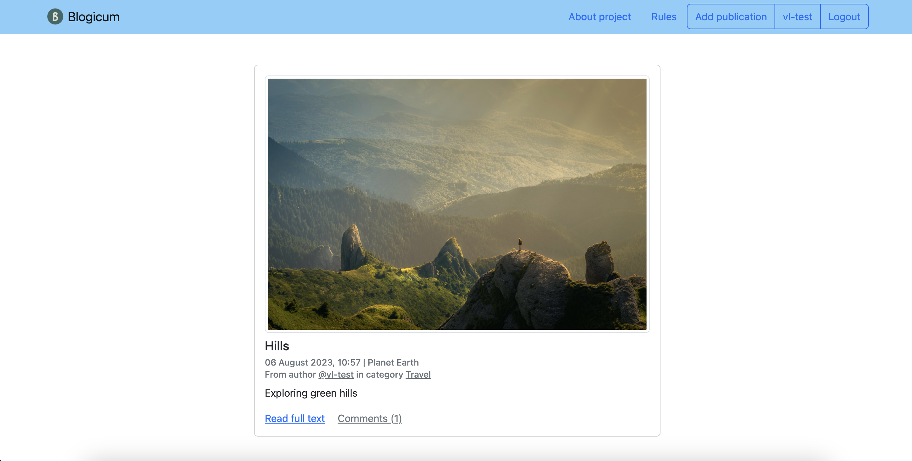

# Blogicum
This is an application for creating publications with an image, description, and a comment section. 

The project is deployed at <a href="https://newblogicum.pythonanywhere.com/" target="_blank">https://newblogicum.pythonanywhere.com/</a>

All publications are displayed on the main page for all users. Clicking "read full text" or "comments" opens a detailed preview of a publication, where users can leave their comments.



## Run locally
1. Clone repository.  
2. Install dependencies (```$pip install -r requirements.txt```).  
3. While in the 'blogicum' directory (with manage.py) run ```$python manage.py runserver```.